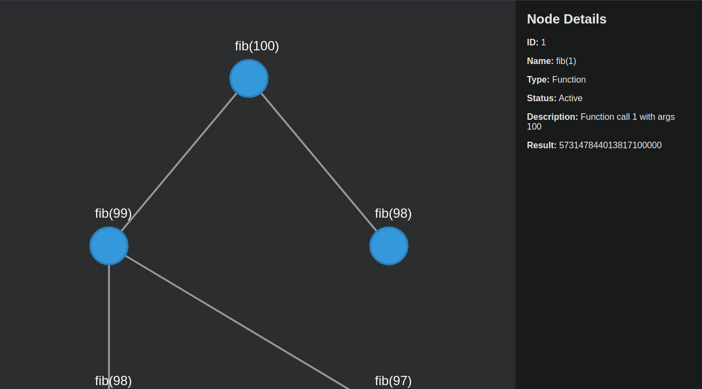

# Python Call Graph Tracker

This project provides tools to visualize and analyze function calls in Python using decorators. It is especially useful for tracking recursion and understanding complex function call chains by creating visual call graphs. The call graph is automatically rendered and opened in a browser for easy inspection.

## Demo 


## Features
- Tracks function calls using the `track_calls` decorator.
- Supports visualizing recursive and nested function calls.
- Integrates with decorators like `functools.cache`.
- Creates call graphs and opens them in the default web browser.

## Getting Started


### Usage
1. Import the `track_calls` decorator and the `write_to_file` function:
   ```python
   from functools import cache
   from decorator import track_calls, write_to_file

   @track_calls
   @cache
   def fib(n):
       if n <= 1:
           return 1
       return fib(n - 1) + fib(n - 2)

   print(fib(500))
   write_to_file()
   ```

### How It Works
- **`track_calls` Decorator**: Assigns a unique identifier (UID) to each function invocation and tracks parent-child relationships. Captures and prints arguments to provide insight into each function call.
- **`write_to_file` Function**: Generates a call graph in HTML file and opens it in the default web browser.

### Project Structure
```
.
├── README.md         # Project documentation
├── decorator.py      # Contains the track_calls and write_to_file functions
└── main.py           # Contains the main file and example
```

### API Reference
- **`track_calls`**:
  - Decorator used to track the depth and arguments of each function call.
  - Generates a unique UID for every invocation.
  - Usage: `@track_calls` above the function definition.

- **`write_to_file()`**:
  - Renders the tracked function calls into a call graph. 
  - Opens the generated graph in a browser window.
  - Should be called after the tracked function has completed execution.

### Contributions
Feel free to open issues, contribute code, or suggest improvements!
